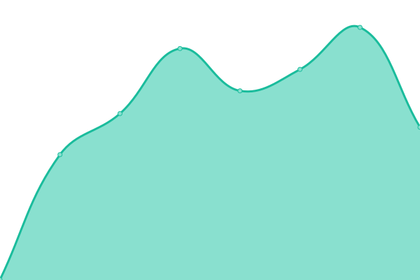

# [📈 Live Status](https://itfin-io.github.io/itfin-io-uptime): <!--live status--> **🟩 All systems operational**

This repository contains the open-source uptime monitor and status page for [ITFin](https://itfin.io), powered by [Upptime](https://github.com/upptime/upptime).

With [Upptime](https://upptime.js.org), you can get your own unlimited and free uptime monitor and status page, powered entirely by a GitHub repository. We use [Issues](https://github.com/itfin-io/itfin-io-uptime/issues) as incident reports, [Actions](https://github.com/itfin-io/itfin-io-uptime/actions) as uptime monitors, and [Pages](https://itfin-io.github.io/itfin-io-uptime) for the status page.

<!--start: status pages-->
<!-- This summary is generated by Upptime (https://github.com/upptime/upptime) -->
<!-- Do not edit this manually, your changes will be overwritten -->
<!-- prettier-ignore -->
| URL | Status | History | Response Time | Uptime |
| --- | ------ | ------- | ------------- | ------ |
|  [itfin](https://app.itfin.io) | 🟩 Up | [itfin.yml](https://github.com/itfin-io/itfin-io-uptime/commits/HEAD/history/itfin.yml) | 

 656ms
     
 | 

<a href="https://itfin-io.github.io/itfin-io-uptime/history/itfin">100.00%</a>
    

|  [nomi](https://nomi.tools) | 🟩 Up | [nomi.yml](https://github.com/itfin-io/itfin-io-uptime/commits/HEAD/history/nomi.yml) | 

 398ms
     
 | 

<a href="https://itfin-io.github.io/itfin-io-uptime/history/nomi">100.00%</a>
    

|  [nomi-api](https://api.nomi.tools) | 🟩 Up | [nomi-api.yml](https://github.com/itfin-io/itfin-io-uptime/commits/HEAD/history/nomi-api.yml) | 

 780ms
     
 | 

<a href="https://itfin-io.github.io/itfin-io-uptime/history/nomi-api">100.00%</a>
    

|  [nomi-welcome](https://welcome.nomi.tools) | 🟩 Up | [nomi-welcome.yml](https://github.com/itfin-io/itfin-io-uptime/commits/HEAD/history/nomi-welcome.yml) | 

 377ms
     
 | 

<a href="https://itfin-io.github.io/itfin-io-uptime/history/nomi-welcome">100.00%</a>
    

<!--end: status pages-->

[**Visit our status website →**](https://itfin-io.github.io/itfin-io-uptime)

## 📄 License

- Powered by: [Upptime](https://github.com/upptime/upptime)
- Code: [MIT](./LICENSE) © [Anand Chowdhary](https://anandchowdhary.com), supported by [Pabio](https://pabio.com)
- Data in the `./history` directory: [Open Database License](https://opendatacommons.org/licenses/odbl/1-0/)
